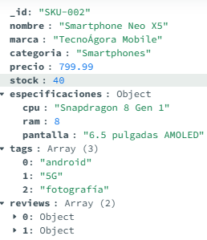
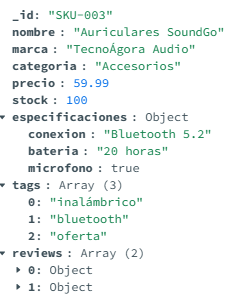

# 🧮 Práctica MongoDB – Consultas y Actualizaciones (TecnoÁgora)

## 📸 Capturas de los documentos insertados en la base de datos



---

## 🧠 Ejercicio 1: Encontrar portátiles de una marca con más de 8GB de RAM

Se desea obtener todos los productos cuya categoría sea “Portátiles”, que pertenezcan a la marca **TecnoÁgora Devices** y cuya memoria RAM sea superior a **8GB**.

**Pista:**  
Para acceder a un campo dentro de un objeto embebido, se utiliza la notación de punto (`especificaciones.ram`).  
Para indicar “mayor que”, puedes usar el operador `$gt`.

**Tu tarea:**  
Escribe la consulta `find()` que cumpla con estos tres criterios.

```json
db.productos.find({
  "categoria": "Portátiles",
  "marca": "TecnoÁgora Devices",
  "especificaciones.ram": { $gt: 8 }
})
```

---

## 🏷️ Ejercicio 2: Buscar productos con la etiqueta “oferta”

Los arreglos en MongoDB permiten búsquedas directas sobre sus valores.  
Se desea encontrar todos los documentos que contengan la palabra **“oferta”** dentro del campo `tags`.

**Tu tarea:**  
Escribe la consulta `find()` para obtener estos productos.

```json
db.productos.find({
  "tags.2": "oferta"
})
```

---

## 📦 Ejercicio 3: Incrementar el stock de un producto en 10 unidades

En ocasiones es necesario actualizar el valor de un campo numérico.  
Se desea incrementar el **stock** de un producto específico (por ejemplo, “Portátil Pro-Book X1”) en **10 unidades**.

**Pista:**  
MongoDB ofrece el operador `$inc` para incrementar el valor actual de un campo en una cantidad específica.  
Utiliza `updateOne()` para aplicar el cambio a un solo documento.

**Tu tarea:**  
Escribe la consulta `updateOne()` para realizar esta operación.

```json
db.productos.updateOne(
  { "nombre": "Portátil Pro-Book X1" },
  { $inc: { "stock": 10 } }
)

```

---

## 💬 Ejercicio 4: Añadir una nueva reseña (review) a un producto

Se desea agregar una nueva reseña a un producto existente (por ejemplo, “Portátil Pro-Book X1”).  
La reseña debe contener el nombre del usuario, una puntuación y un comentario.

**Pista:**  
Para agregar un nuevo elemento a un arreglo existente, se utiliza el operador `$push`.  
Deberás usar `updateOne()`.

**Tu tarea:**  
Escribe la consulta `updateOne()` para añadir una nueva reseña al producto.

```json
db.productos.find({
  
})
```

---
