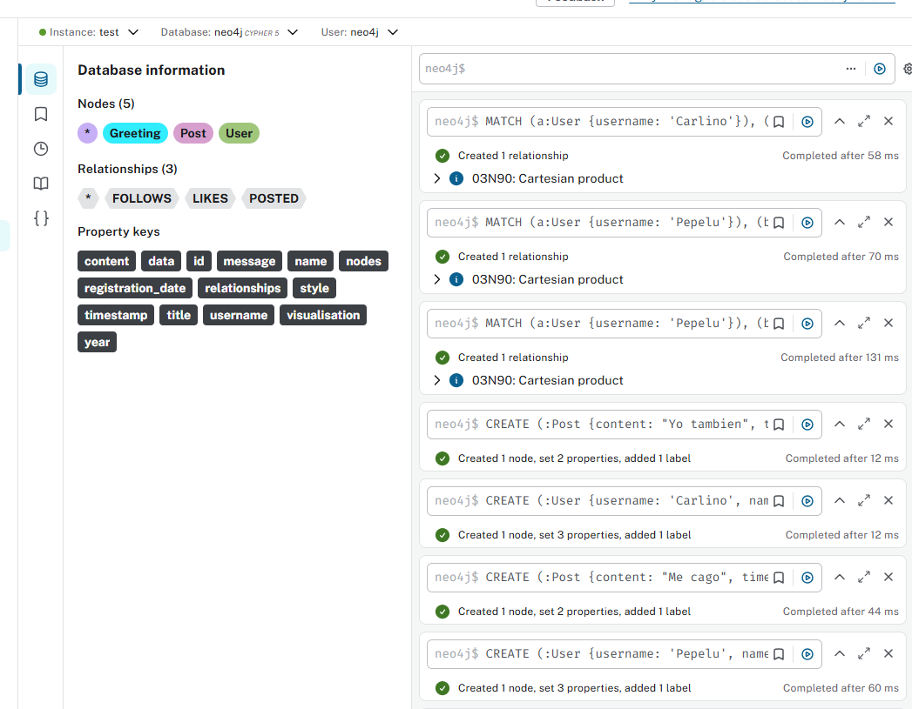
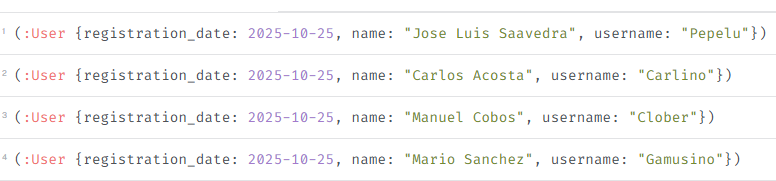
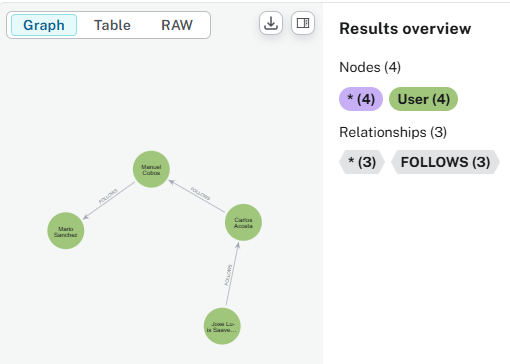
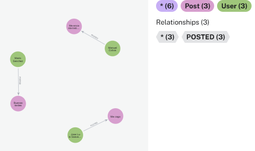
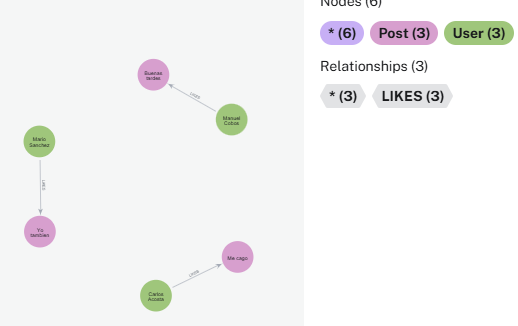
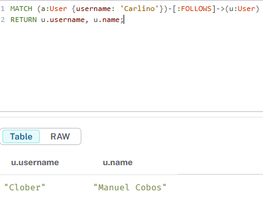
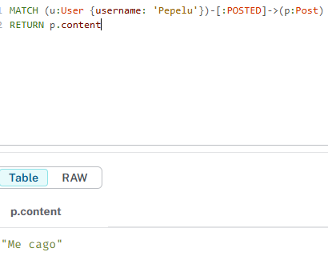
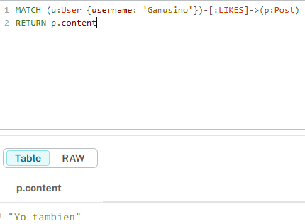
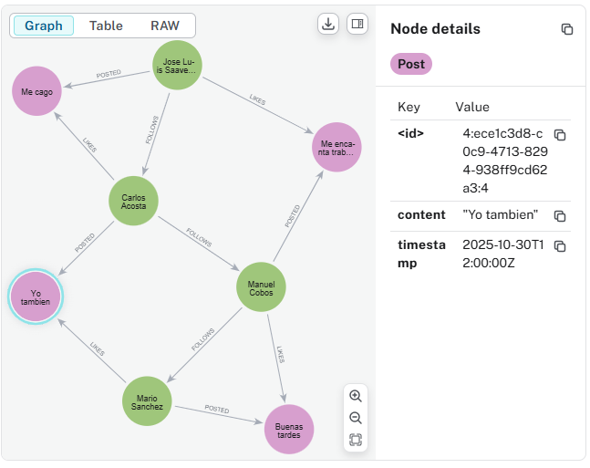

# Parte 3: Modelado y Creación de una Red Social

Ahora, vamos a aplicar los conceptos de grafos para construir una red social básica.

## Ejercicio 1: Diseño del Modelo de Datos de la Red Social

Diseña un modelo de datos de grafo para representar usuarios y sus interacciones en una red social. Considera los siguientes tipos de nodos y relaciones:

### Nodos
- **User**: Con propiedades como `username`, `name`, `registration_date`.
- **Post**: Con propiedades como `content`, `timestamp`.

### Relaciones
- **FOLLOWS**: Entre `User` y `User`.
- **POSTED**: Entre `User` y `Post`.
- **LIKES**: Entre `User` y `Post`.

**Tu tarea**: Dibuja o describe el esquema de tu grafo, mostrando los tipos de nodos, sus propiedades, los tipos de relaciones y sus propiedades.

---

## Ejercicio 2: Creación de Nodos y Relaciones Iniciales

Utiliza Cypher para crear los siguientes nodos y relaciones en tu base de datos.

### Crear algunos nodos User
**Tu tarea**: Crea al menos tres nodos de tipo `User` con las propiedades `username`, `name` y `registration_date`. Asegúrate de que los `username` sean únicos.

### Crear relaciones FOLLOWS
**Tu tarea**: Crea algunas relaciones de tipo `FOLLOWS` entre tus usuarios (por ejemplo, Alice sigue a Bob, Bob sigue a Charlie).

### Crear algunos Post y relaciones POSTED
**Tu tarea**: Haz que al menos dos de tus usuarios publiquen un `Post`. Cada `Post` debe tener `content` y `timestamp`.

### Crear relaciones LIKES
**Tu tarea**: Haz que un usuario dé “Like” a un post de otro usuario.

---

# Parte 4: Consultas en la Red Social con Cypher

Ahora que tienes una red social modelada, vamos a realizar algunas consultas para extraer información y descubrir patrones.

## Ejercicio 3: Encontrar Amigos y Seguidores

### Encontrar todos los usuarios que un usuario específico sigue
**Tu tarea**: Escribe una consulta Cypher para encontrar todos los usuarios que ‘Alice’ (o cualquier usuario que hayas creado) sigue.

### Encontrar todos los usuarios que siguen a un usuario específico
**Tu tarea**: Escribe una consulta Cypher para encontrar todos los usuarios que siguen a ‘Bob’ (o cualquier usuario que hayas creado).

---

## Ejercicio 4: Analizando Posts e Interacciones

### Encontrar todos los posts de un usuario específico
**Tu tarea**: Escribe una consulta Cypher para encontrar todos los posts de ‘Alice’ (o cualquier usuario que hayas creado), mostrando el contenido y la fecha/hora.

### Encontrar los posts que un usuario ha dado “Like”
**Tu tarea**: Escribe una consulta Cypher para encontrar los posts a los que ‘Alice’ (o cualquier usuario que hayas creado) ha dado “Like”, mostrando el contenido del post.

---

# Parte 5: Visualización y Exploración

El Neo4j Browser ofrece una potente interfaz de visualización para explorar tu grafo.

## Ejercicio 5: Explorando el Grafo Visualmente

- Ejecuta algunas de tus consultas anteriores en el Neo4j Browser.
- Experimenta con las opciones de visualización:
  - Arrastra nodos para reorganizar el grafo.
  - Haz doble clic en un nodo para expandir sus relaciones.
  - Usa el panel de estilos para cambiar colores y tamaños de nodos/relaciones.

**Tu tarea**: Realiza una captura de pantalla de una visualización interesante de tu red social (por ejemplo, un grupo de amigos, o un post y sus interacciones).

