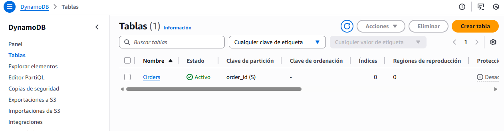
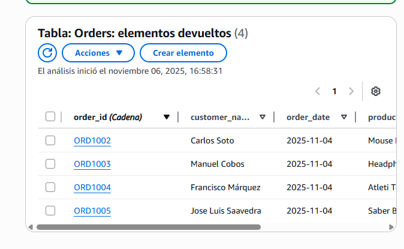
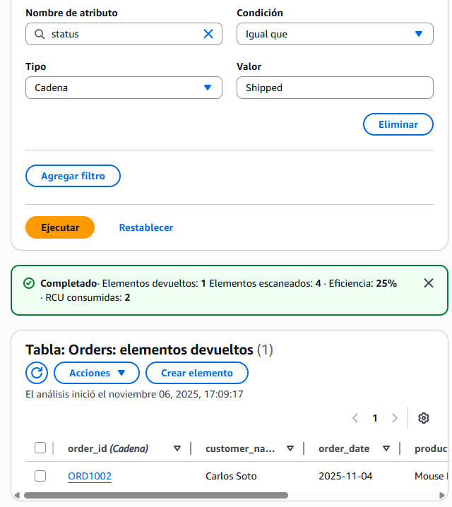
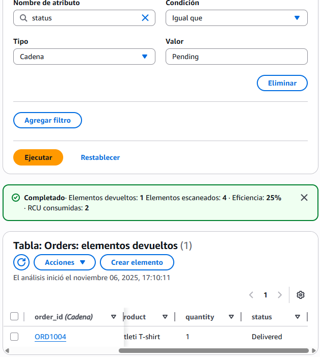
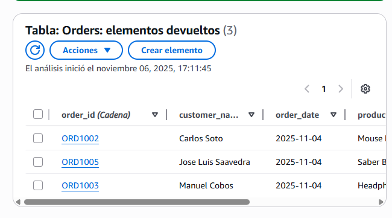

# 1. Creando nuestra primera tabla en la nube

Lo primero es crear el “contenedor” para nuestros datos. En **DynamoDB**, estos contenedores se llaman **tablas**.

1. Inicia sesión en la **Consola de AWS**.  
2. En el buscador de servicios, escribe **DynamoDB** y accede a su panel.  
3. Haz clic en **“Create table”**.  
4. Configura los siguientes valores:
   - **Table name:** `Orders`
   - **Partition key:** `order_id` (asegúrate de que el tipo sea **String**).
5. Deja el resto de opciones con sus valores por defecto y haz clic en **“Create table”**.

¡Listo! En segundo plano, AWS ha creado una **tabla distribuida y de alta disponibilidad**.  
La **clave de partición (`order_id`)** es fundamental: DynamoDB la usa internamente para distribuir los datos entre múltiples servidores, garantizando un acceso ultrarrápido siempre que busques un pedido por su ID.

📸 **Captura #1:** Muestra una imagen de tu tabla `Orders` creada correctamente en la consola de DynamoDB.



---

# 2. Insertando nuestros primeros pedidos

Ahora que tenemos la tabla, vamos a añadirle datos.

1. En el menú de la izquierda, dentro de tu tabla, ve a **“Explore items”**.  
2. Haz clic en **“Create item”**.  
3. La forma más sencilla de insertar datos complejos es usando la vista **JSON**.  
   Pega el siguiente contenido (fíjate en la sintaxis: DynamoDB requiere que especifiques el tipo de dato `"S"` para *String* y `"N"` para *Number*).

```json
{
  "order_id": { "S": "ORD1002" },
  "customer_name": { "S": "Carlos Soto" },
  "product": { "S": "Mouse Logitech" },
  "quantity": { "N": "1" },
  "order_date": { "S": "2025-11-04" },
  "status": { "S": "Shipped" }
}
```
Haz clic en “Create item”.  
¡Tu turno! Repite el proceso y añade al menos tres pedidos más, con datos diferentes. Varía los productos, clientes y estados (Pending, Shipped, Delivered).  

**Captura #2:** Muestra una vista de la tabla con todos los ítems que has creado.



---

# 3. Explorando y modificando los datos

Con los datos ya en la tabla, veamos cómo consultarlos y actualizarlos.

Dentro de “Explore items”, puedes ver todos los pedidos.  
La consola ofrece una opción para filtrar (**Filter items**). Úsala para encontrar pedidos que cumplan ciertas condiciones. Por ejemplo:  

- Busca todos los pedidos con status igual a `"Shipped"`.  
- Busca los pedidos de un cliente específico.  
- Haz clic sobre cualquiera de los ítems para ver sus detalles.  
- Puedes editar un campo directamente desde esta vista. Busca un pedido con estado `"Pending"` y cámbialo a `"Delivered"`. Guarda los cambios.

## Scan vs. Query

La función “Filter” de la consola ejecuta una operación llamada **Scan**.  
Un **Scan** lee todos los ítems de la tabla y luego filtra los resultados. Es flexible, pero puede ser lento y costoso en tablas grandes.  

Una operación **Query**, en cambio, es mucho más eficiente, ya que busca directamente usando la clave primaria o un índice.  
Para usar **Query**, necesitarías definir índices secundarios, un concepto más avanzado.

**Captura #3:** Incluye una captura del filtro aplicado y otra del ítem que has actualizado.





---

# 4. Eliminando un pedido

Finalmente, vamos a eliminar un ítem. En **DynamoDB**, la forma más eficiente de eliminar es usando su **clave primaria**.

En la vista “Explore items”, selecciona el ítem que deseas borrar marcando la casilla a su izquierda.  
Haz clic en el menú “Actions” y selecciona **“Delete item”**.  
Confirma la eliminación. El ítem desaparecerá permanentemente.  

**Captura #4:** Muestra el resultado de la tabla después de haber eliminado uno de los ítems.



---

# Reflexión Final: DynamoDB en el Ecosistema NoSQL

Ahora que has trabajado con **DynamoDB**, es hora de comparar.  
¿En qué se parece y en qué se diferencia de otras bases de datos **NoSQL** como **MongoDB**?

## Modelo de Datos

**DynamoDB** es principalmente una base de datos **Clave-Valor**, aunque su soporte para **JSON anidado** le da características de base de datos Documental.  
Está altamente optimizada para búsquedas por clave.

**MongoDB** es una base de datos **Documental pura**.  
Ofrece más flexibilidad para consultar por cualquier campo del documento y tiene un lenguaje de consulta más rico, pero requiere más gestión.

---

## Gestión y Escalado

**DynamoDB** es **Serverless**. AWS gestiona todo.  
El escalado es automático y transparente. Ideal para quienes no quieren preocuparse por la infraestructura.

**MongoDB** (en su versión auto-alojada) requiere que tú gestiones los servidores, la replicación y el sharding (escalado horizontal).  
**MongoDB Atlas** es su equivalente “serverless”, pero **DynamoDB** está más integrado en el ecosistema de AWS.

---

## Para tu informe final, incluye una sección de reflexión respondiendo a estas preguntas:

- **Comparativa:** ¿Qué diferencias clave notaste entre trabajar con DynamoDB y lo que has visto de MongoDB?  
  (Piensa en la sintaxis de inserción, las consultas, el esquema…).  

  Que DynamoDB me parece mas comodo y sencillo de usar por la claridad del entorno visual.

- **Ventajas Serverless:** ¿Qué beneficios crees que aporta un servicio como DynamoDB a un equipo de desarrollo?  
  ¿Y qué inconvenientes podría tener? 

  Que es serverless y basante util para editar valores de una tabla con ayuda del filtrado.

  Como inconveniente esta el límite de tiempo que tiene y tambien que alomejor se puede caer amazon y no podrías trabajar.

- **Experiencia:** ¿Qué te resultó más fácil de esta práctica?  
  ¿Qué fue lo más complicado o confuso?

  Todo fue bastante facil, ya que se hace todo con el apartado visual.
