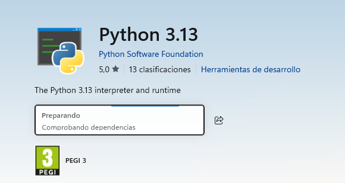
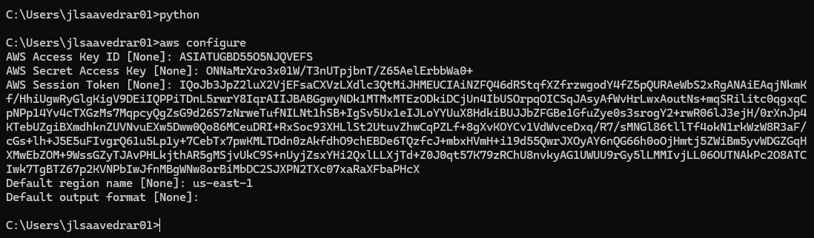
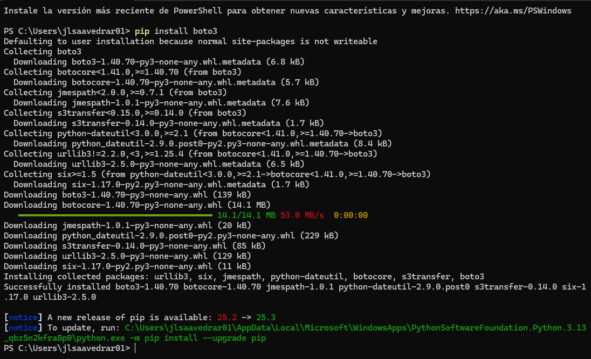
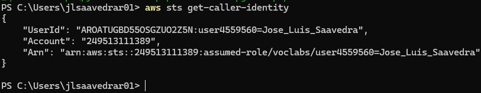
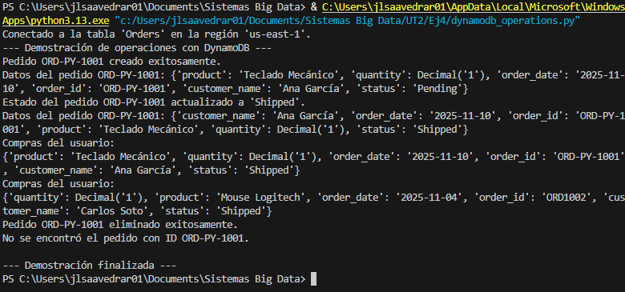

# Parte 1: Preparando el Entorno de Programación

Antes de escribir una sola línea de código Python, debemos asegurarnos de que nuestro entorno local puede comunicarse de forma segura con nuestra cuenta de AWS.

## 1.1. Instalación de Boto3

- **Instala la AWS CLI:** Sigue la guía oficial de instalación.  
- **Instala Boto3:**

```bash
pip install boto3
```
Boto3 es la herramienta que permitirá a tus scripts de Python llamar a la API de AWS para controlar servicios como DynamoDB, S3, EC2 y muchos más.

## 1.2. Verificación de las Credenciales

Boto3 es inteligente: buscará automáticamente las credenciales que configuraste con la AWS CLI. Para asegurarte de que todo está en orden, ejecuta este comando en tu terminal:

```bash
aws sts get-caller-identity
```
Si el comando devuelve la información de tu rol de AWS Academy (un ARN similar a `arn:aws:sts::...`), significa que Boto3 podrá autenticarse sin problemas. No necesitas escribir tus claves secretas en el código (**¡nunca lo hagas!**).

## CAPTURAS INSTALACIÓN

### Instalación de Python:



### Configuración de AWS: 



### Instalación de Boto3:



### Verificación de credenciales AWS:




# Parte 2: Automatizando Operaciones con Boto3

Ahora empieza lo divertido. Crea un archivo en tu editor de código favorito y llámalo `dynamodb_operations.py`. A lo largo de esta sección, añadiremos funciones a este script para interactuar con nuestra tabla **Orders**.

## 2.1. Conexión a DynamoDB


### Ejercicio 1: Crear un Nuevo Pedido


### Ejercicio 2: Leer un Pedido


### Ejercicio 3: Actualizar el Estado de un Pedido


### Ejercicio 4: Eliminar un Pedido


### Ejercicio 5: Buscar Pedidos por Cliente


## CÓDIGO:

```python
import boto3

# 1. Crear un recurso de servicio de DynamoDB
# Reemplaza 'us-east-1' con la región que estés utilizando
dynamodb = boto3.resource('dynamodb', region_name='us-east-1')

# 2. Seleccionar la tabla 'Orders'
table = dynamodb.Table('Orders')

# 3. Imprimir un mensaje de confirmación
print(f"Conectado a la tabla '{table.name}' en la región '{dynamodb.meta.client.meta.region_name}'.")

def create_order(order_id, customer_name, product, quantity, status):
    '''Crea un nuevo ítem en la tabla Orders.'''
    try:
        response = table.put_item(
           Item={
                'order_id': order_id,
                'customer_name': customer_name,
                'product': product,
                'quantity': quantity,
                'status': status,
                'order_date': '2025-11-10' # Puedes usar una fecha actual
            }
        )
        print(f"Pedido {order_id} creado exitosamente.")
        return response
    except Exception as e:
        print(f"Error al crear el pedido: {e}")

def get_order(order_id):
    '''Obtiene un ítem de la tabla Orders por su ID.'''
    try:
        response = table.get_item(Key={'order_id': order_id})
        item = response.get('Item')
        if item:
            print(f"Datos del pedido {order_id}: {item}")
            return item
        else:
            print(f"No se encontró el pedido con ID {order_id}.")
            return None
    except Exception as e:
        print(f"Error al obtener el pedido: {e}")

def update_order_status(order_id, new_status):
    '''Actualiza el atributo 'status' de un pedido.'''
    try:
        response = table.update_item(
            Key={'order_id': order_id},
            UpdateExpression="set #st = :s",
            ExpressionAttributeNames={'#st': 'status'},
            ExpressionAttributeValues={':s': new_status},
            ReturnValues="UPDATED_NEW"
        )
        print(f"Estado del pedido {order_id} actualizado a '{new_status}'.")
        return response
    except Exception as e:
        print(f"Error al actualizar el pedido: {e}")

def delete_order(order_id):
    '''Elimina un item de la tabla Orders.'''
    try:
        response = table.delete_item(Key={'order_id': order_id})
        print(f"Pedido {order_id} eliminado exitosamente.")
        return response
    except Exception as e:
        print(f"Error al eliminar el pedido: {e}")

def get_orders_by_customer(customer_name):
    """Devuelve todos los pedidos realizados por un cliente concreto."""
    from boto3.dynamodb.conditions import Attr

    response = table.scan(
        FilterExpression=Attr('customer_name').eq(customer_name)
    )

    print("Compras del usuario:")
    for item in response.get('Items', []):
        print(item)
    pass


if __name__ == "__main__":
    print("--- Demostración de operaciones con DynamoDB ---")

    # 1. Crear un nuevo pedido
    create_order("ORD-PY-1001", "Ana García", "Teclado Mecánico", 1, "Pending")

    # 2. Leer el pedido recién creado
    get_order("ORD-PY-1001")

    # 3. Actualizar su estado
    update_order_status("ORD-PY-1001", "Shipped")
    get_order("ORD-PY-1001") # Verificamos el cambio

    # 4. Buscar todos los pedidos de un cliente (usa un nombre que exista en tu tabla)
    get_orders_by_customer("Ana García")
    get_orders_by_customer("Carlos Soto") # Ejemplo con otro cliente

    # 5. Eliminar el pedido
    delete_order("ORD-PY-1001")
    get_order("ORD-PY-1001") # Verificamos que ya no existe

    print("\n--- Demostración finalizada ---")
```

## CAPTURA:



## PREGUNTAS:

### 1. Automatización vs. Consola
- **Ventajas:** Repetir tareas fácilmente y manejar muchos datos.  
- **Desventajas:** Necesita programar y cuidado con errores.

### 2. Uso de Boto3
- Automatizar S3, EC2, SNS, SQS o IAM.

### 3. Dificultades y aprendizajes
- **Difícil:** Un error que me dio la expiración del token de sesión de AWS.  
- **Interesante:** Automatizar tareas en AWS desde Python.
