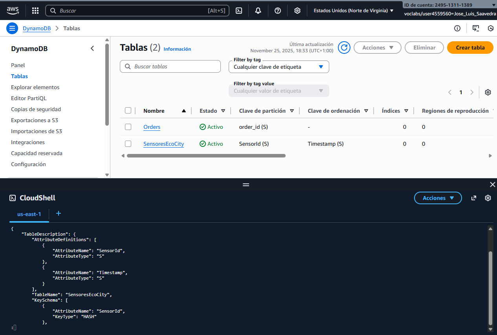
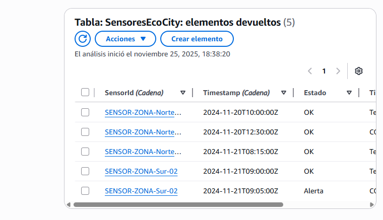
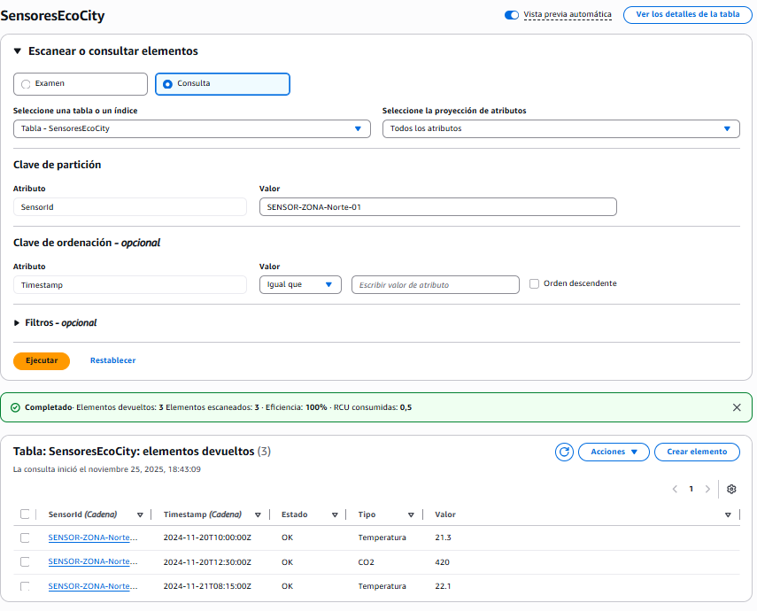
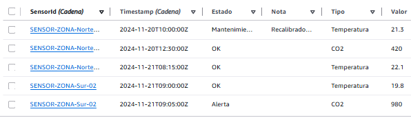
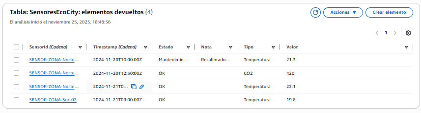

# Práctica 5: Operaciones CRUD en DynamoDB

## Contexto: La Ciudad Inteligente (Smart City)

Has sido contratado como **Ingeniero de Datos** para el proyecto **“EcoCity”**.  
La ciudad ha desplegado miles de sensores ambientales para monitorear la calidad del aire, el ruido y la temperatura en tiempo real.

Necesitamos un sistema capaz de ingerir millones de lecturas de sensores y permitir consultas rápidas para analizar el estado de diferentes zonas de la ciudad a lo largo del tiempo.  
Tu misión es implementar este backend en **Amazon DynamoDB**.

---

## Requisitos del Sistema

Debes diseñar una tabla que cumpla con las siguientes especificaciones:

- **Nombre de la Tabla:** `SensoresEcoCity`
- **Patrón de Acceso Principal:** recuperar rápidamente todas las lecturas históricas de un sensor específico, ordenadas desde la más reciente a la más antigua.
- **Datos a almacenar:**
  - ID del Sensor (ej. `SENSOR-ZONA-Norte-01`)
  - Timestamp de la lectura (ej. `2024-11-20T10:00:00Z`)
  - Tipo de Medición (ej. CO2, Ruido, Temperatura)
  - Valor (Numérico)
  - Estado (ej. OK, Alerta, Mantenimiento)

---

## Instrucciones de la Práctica

Realiza las siguientes operaciones y documenta cada paso.

### 1. Diseño y Creación de la Tabla


**Código:**  
```python
aws dynamodb create-table \
  --table-name SensoresEcoCity \
  --attribute-definitions AttributeName=SensorId,AttributeType=S AttributeName=Timestamp,AttributeType=S \
  --key-schema AttributeName=SensorId,KeyType=HASH AttributeName=Timestamp,KeyType=RANGE \
  --billing-mode PAY_PER_REQUEST

```

**Captura:**  



---

### 2. Ingesta de Datos (Create)

**Código:**  
```python
aws dynamodb put-item --table-name SensoresEcoCity --item '{
  "SensorId": {"S": "SENSOR-ZONA-Norte-01"},
  "Timestamp": {"S": "2024-11-20T10:00:00Z"},
  "Tipo": {"S": "Temperatura"},
  "Valor": {"N": "21.3"},
  "Estado": {"S": "OK"}
}'

aws dynamodb put-item --table-name SensoresEcoCity --item '{
  "SensorId": {"S": "SENSOR-ZONA-Norte-01"},
  "Timestamp": {"S": "2024-11-20T12:30:00Z"},
  "Tipo": {"S": "CO2"},
  "Valor": {"N": "420"},
  "Estado": {"S": "OK"}
}'

aws dynamodb put-item --table-name SensoresEcoCity --item '{
  "SensorId": {"S": "SENSOR-ZONA-Norte-01"},
  "Timestamp": {"S": "2024-11-21T08:15:00Z"},
  "Tipo": {"S": "Temperatura"},
  "Valor": {"N": "22.1"},
  "Estado": {"S": "OK"}
}'

aws dynamodb put-item --table-name SensoresEcoCity --item '{
  "SensorId": {"S": "SENSOR-ZONA-Sur-02"},
  "Timestamp": {"S": "2024-11-21T09:00:00Z"},
  "Tipo": {"S": "Temperatura"},
  "Valor": {"N": "19.8"},
  "Estado": {"S": "OK"}
}'

aws dynamodb put-item --table-name SensoresEcoCity --item '{
  "SensorId": {"S": "SENSOR-ZONA-Sur-02"},
  "Timestamp": {"S": "2024-11-21T09:05:00Z"},
  "Tipo": {"S": "CO2"},
  "Valor": {"N": "980"},
  "Estado": {"S": "Alerta"}
}'

```

**Captura:**  



---

### 3. Consulta de Datos (Read - Query)


**Captura:**  



---

### 4. Actualización de Datos (Update)

**Código:**  
```python
aws dynamodb update-item \
  --table-name SensoresEcoCity \
  --key '{"SensorId":{"S":"SENSOR-ZONA-Norte-01"},"Timestamp":{"S":"2024-11-20T10:00:00Z"}}' \
  --update-expression "SET Estado = :m, Nota = :n" \
  --expression-attribute-values '{":m":{"S":"Mantenimiento"}, ":n":{"S":"Recalibrado por técnico"}}' \
  --return-values ALL_NEW

```

**Captura:**  



---

### 5. Eliminación de Datos (Delete)

**Código:**  
```python
aws dynamodb delete-item \
  --table-name SensoresEcoCity \
  --key '{"SensorId":{"S":"SENSOR-ZONA-Sur-02"},"Timestamp":{"S":"2024-11-21T09:05:00Z"}}'

```

**Captura:**  



---

### Conclusion

## Conclusión

## Conclusión

DynamoDB es ideal para datos de IoT porque maneja gran volumen de lecturas en tiempo real y permite consultas rápidas, siempre que se diseñen bien las claves e índices.

