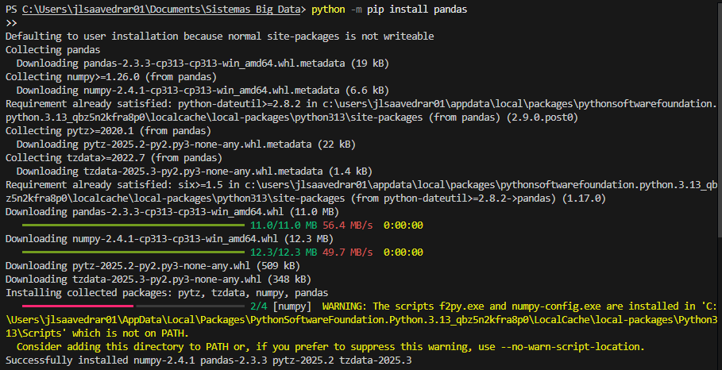
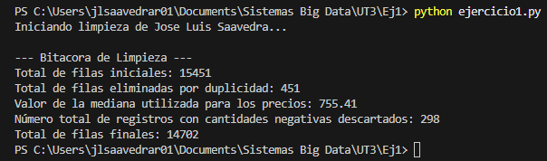
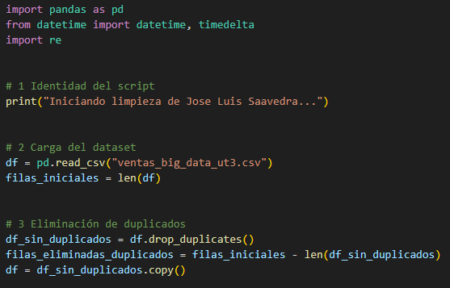
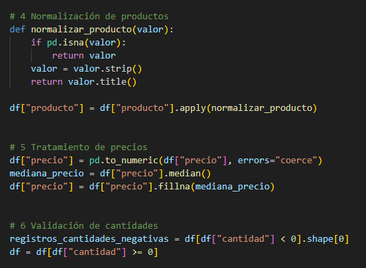
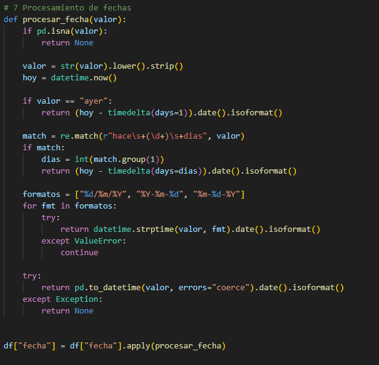
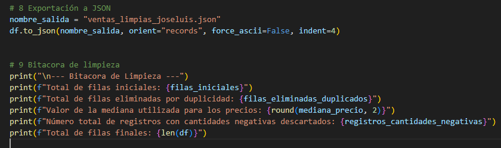

# Práctica 1: Hijo de la Forja (Limpieza de Datos Masivos)

En esta práctica, trabajarás con un dataset de ventas que contiene más de 15,000 registros. Los datos presentan múltiples inconsistencias que deben ser resueltas antes de que puedan ser procesados por un sistema de análisis.

## Objetivo

Desarrollar un script de Python que realice la limpieza, normalización y validación de una fuente de datos masiva, generando un archivo final estructurado y fiable.

## Recursos

- **Dataset:** ventas_big_data_ut3.csv (Enlace de Google Drive).
- **Librería necesaria:** pandas (`pip install pandas`).

## Requisitos de Personalización (Obligatorio)

Para asegurar la autoría, tu script debe cumplir con lo siguiente:

- **Identidad:** El script debe imprimir por consola al inicio:  
  `"Iniciando limpieza de [Tu Nombre y Apellidos]..."`.
- **Archivo de salida:** El archivo generado debe llamarse obligatoriamente  
  `ventas_limpias_[TuNombre].json`.

## Tareas de Limpieza y Transformación

Tu script debe abordar los siguientes desafíos técnicos:

### Eliminación de duplicados

- Se considera un duplicado cuando todos los campos de la fila son idénticos.
- Especial atención a los casos donde el id se repite pero los datos varían (estos no deben borrarse automáticamente).

### Normalización de productos

- Eliminar espacios en blanco y convertir a formato CamelCase o Capitalizado.

### Tratamiento de precios

- Localizar valores no numéricos (como “ERR”) y tratarlos como nulos.
- Imputar los valores faltantes utilizando la mediana de la columna.

### Validación de cantidades

- Detectar y filtrar registros con cantidades negativas (considerarlos errores de entrada).

### Estandarización temporal

- Convertir diversos formatos de fecha al estándar ISO.
- Resolver valores relativos como “Ayer” o “Hace 2 dias” calculando la fecha real respecto al día de hoy (usa `datetime.now()`).

## Requisito Especial: La Bitácora de Limpieza

Tu script no solo debe limpiar, sino informar. Al final de la ejecución, el programa debe imprimir un resumen con:

- Total de filas iniciales.
- Total de filas eliminadas por duplicidad.
- Valor de la mediana utilizada para los precios.
- Número total de registros con “cantidades negativas” descartados.

## Pasos sugeridos

1. **Carga del dataset:** Utilizar `read_csv` y analizar la estructura inicial con `info()`.
2. **Fase de Limpieza Estructural:** Aplicar `drop_duplicates` y realizar el filtrado de cantidades.
3. **Fase de Transformación:** Asegurar tipos de datos y manejar errores de conversión con `errors='coerce'`.
4. **Procesamiento de Fechas:** Desarrollar una función que use `datetime` para transformar “Hace X dias” en fechas reales.
5. **Exportación y Reporte:** Guardar en JSON e imprimir la bitácora final.

## Preguntas de reflexión

- ¿Cuántos registros se perdieron en total tras todo el proceso de limpieza?
- ¿Hubo algún caso de id repetido con datos distintos? ¿Cómo decidiste manejarlo para no perder información?
- ¿Por qué crees que es más seguro usar la mediana que la media para imputar precios en este dataset con errores manualles?

## Capturas del ejercicio:

### Instalación de pandas

### Respuesta de terminal

### Capturas del codigo

Identidad carga y duplicados

Normalización, tratamiento de precios y validación

Fechas

JSON y bitacora de limpieza

## Respuesta a las Preguntas de Reflexión

1. **Registros perdidos:** Se eliminaron 749 filas en total: 451 duplicadas y 298 con cantidades negativas.  
2. **Id repetido con datos distintos:** Sí existieron. No se eliminaron porque solo se consideran duplicadas las filas idénticas en todos los campos.  
3. **Mediana vs media para precios:** La mediana es más segura porque no se ve afectada por valores extremos o errores, mientras que la media sí podría distorsionarse.

---

## Conclusión

Limpiar y normalizar los datos asegura que los análisis sean correctos y confiables, y facilita el trabajo con grandes volúmenes de información.
