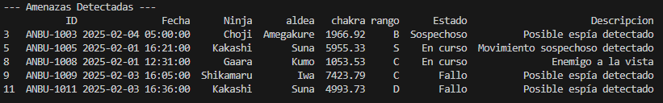
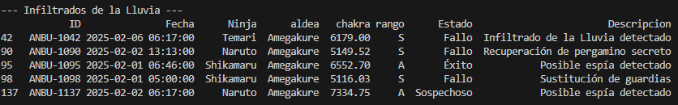
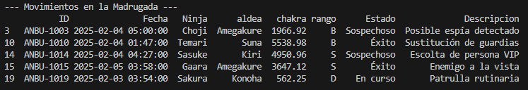
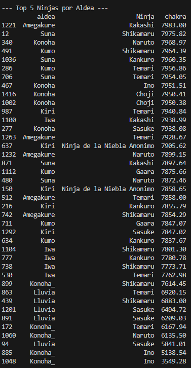
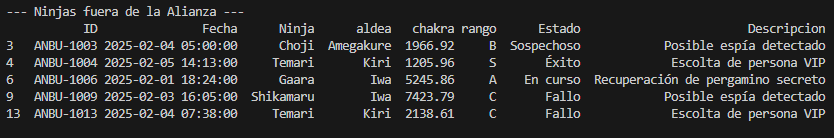
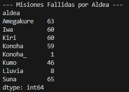

# Práctica 1 -- El Rastro de la Grieta

### Autor: Jose Luis Saavedra

# Bloque A -- Limpieza de Datos

## 1 Eliminación de duplicados

``` python
duplicados = df.duplicated().sum()
df = df.drop_duplicates()
```

Se eliminaron registros idénticos para evitar alterar estadísticas y
resultados.

------------------------------------------------------------------------

## 2 Estandarización de aldeas

``` python
df['aldea'] = df['aldea'].str.strip().str.title()
```

Se normalizaron nombres eliminando espacios y corrigiendo
mayúsculas/minúsculas.

------------------------------------------------------------------------

## 3 Ninjas anónimos de Kiri

``` python
df.loc[(df['nin_id'].isna()) & (df['aldea'] == 'Kiri'),
       'nin_id'] = 'Ninja de la Niebla Anonimo'
```

Se asignó un nombre genérico a ninjas sin identificación.

------------------------------------------------------------------------

## 4 Conversión a datetime

``` python
df['ts'] = pd.to_datetime(df['ts'], errors='coerce')
```

Permite trabajar con horas y fechas correctamente.

------------------------------------------------------------------------

## 5 Control de chakra

``` python
df = df[(df['chakra'] > 0) & (df['chakra'] <= 100000)]
```

Se eliminaron valores físicamente imposibles.

------------------------------------------------------------------------

## 6 Renombrado profesional

``` python
df = df.rename(columns={
    'id_reg': 'ID',
    'ts': 'Fecha',
    'nin_id': 'Ninja',
    'status': 'Estado',
    'desc': 'Descripcion'
})
```

Se adaptaron los nombres al formato solicitado.

------------------------------------------------------------------------

# Bloque B -- Búsqueda y Consultas

## 7 Amenazas detectadas

Filtro de palabras clave: espía, sospechoso, enemigo.

**Captura de consola -- Amenazas detectadas:**\


------------------------------------------------------------------------

## 8 Infiltrados de Amegakure

Filtro: Aldea = Amegakure, Chakra \> 5000, Rango distinto de D.

**Captura de consola -- Infiltrados de la Lluvia:**\


------------------------------------------------------------------------

## 9 Movimientos en la madrugada

Rango horario: 23:00 -- 05:00.

**Captura de consola -- Movimientos nocturnos:**\


------------------------------------------------------------------------

## 10 Top 5 ninjas por aldea

Ordenados por mayor nivel de chakra.

**Captura de consola -- Top 5 por aldea:**\


------------------------------------------------------------------------

## 11 Ninjas fuera de la alianza

Excluidas aldeas: Konoha, Suna, Kumo.

**Captura de consola -- Ninjas extranjeros:**\


------------------------------------------------------------------------

## 12 Misiones fallidas por aldea

Conteo de misiones con estado "Fallo".

**Captura de consola -- Mapa de fallos:**\


------------------------------------------------------------------------

# Preguntas de reflexión

## ¿Cuántos registros duplicados has encontrado y qué impacto tendrían?

Se encontraron 46 registros duplicados.

Si no se eliminaran: - Inflarían estadísticas. - Distorsionarían
resultados. - Aumentarían el coste computacional. - Podrían provocar
decisiones incorrectas.

------------------------------------------------------------------------

## ¿Por qué es crítico convertir la columna de fecha a datetime?

Porque permite extraer la hora, ordenar eventos correctamente y realizar
filtros por franja horaria.\
Si se tratara como texto, el análisis sería incorrecto.

------------------------------------------------------------------------

## ¿Cómo has manejado los niveles de chakra \> 100.000?

Se eliminaron por considerarse valores físicamente imposibles.\
Podrían deberse a errores de sensor o corrupción del dataset.

------------------------------------------------------------------------

# Conclusión

Pandas permite limpiar, transformar y analizar grandes volúmenes de
datos de forma rápida y eficiente.\
Frente a una revisión manual de 1.500 registros, automatizar el proceso
reduce errores humanos y mejora la precisión en la toma de decisiones
estratégicas.
