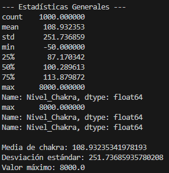
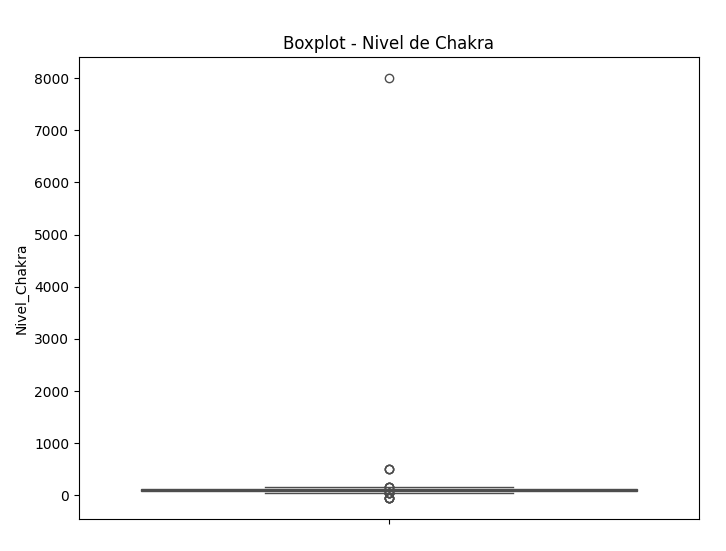
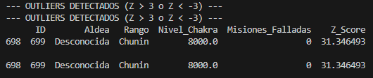
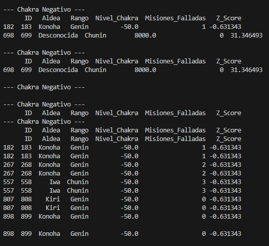
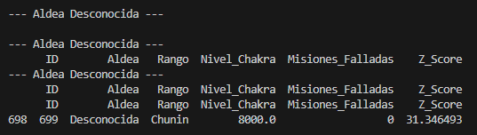
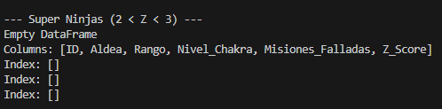

# Práctica 2 -- El Rostro del Traidor (Detección de Anomalías)

Autor: Jose Luis Saavedra

------------------------------------------------------------------------

# 1. El Ojo de la Verdad -- Estadística Descriptiva

Código utilizado:

``` python
print(df["Nivel_Chakra"].describe())

media = df["Nivel_Chakra"].mean()
desviacion = df["Nivel_Chakra"].std()
```

Resultados obtenidos:

-   Media de chakra: 108.93\
-   Desviación estándar: 251.74\
-   Valor mínimo: -50\
-   Valor máximo: 8000

Se observa un valor máximo claramente sospechoso (8000), muy alejado del
resto de los datos.

Captura de consola -- Resultado de .describe():\


------------------------------------------------------------------------

# 2. Jutsu de Visualización -- Boxplot

Código utilizado:

``` python
sns.boxplot(y=df["Nivel_Chakra"], color="orange")
plt.title("Boxplot - Nivel de Chakra")
plt.show()
```

El boxplot permite visualizar valores extremos de forma gráfica.\
En el gráfico se observa un punto completamente aislado en 8000, lo que
indica un posible outlier.

Captura del gráfico Boxplot:\


------------------------------------------------------------------------

# 3. Regla de los 3 Sigmas -- Z-Score

Código utilizado:

``` python
df["Z_Score"] = (df["Nivel_Chakra"] - media) / desviacion
outliers = df[(df["Z_Score"] > 3) | (df["Z_Score"] < -3)]
print(outliers.head())
```

Resultado:

ID sospechoso: 699\
Aldea: Desconocida\
Nivel_Chakra: 8000\
Z-Score: 31.34

Un Z-Score mayor que 3 ya es extremadamente raro.\
Un valor de 31 indica un evento estadísticamente imposible en
condiciones normales.

Captura de consola -- Outliers detectados:\


------------------------------------------------------------------------

# 4. Caza Mayor

## Chakra negativo

Código:

``` python
df[df["Nivel_Chakra"] < 0]
```

Se detectaron varios valores de -50.\
Sin embargo, su Z-Score es -0.63, por lo que no se consideran outliers
extremos.\
Probablemente se trate de un error de sensor.

Captura -- Chakra negativo:\


------------------------------------------------------------------------

## Aldea Desconocida

Código:

``` python
df[df["Aldea"] == "Desconocida"]
```

Se encontró un único registro perteneciente a la aldea "Desconocida",
que coincide con el outlier de 8000.

Captura -- Aldea Desconocida:\


------------------------------------------------------------------------

## Super Ninjas (2 \< Z \< 3)

Código:

``` python
df[(df["Z_Score"] > 2) & (df["Z_Score"] < 3)]
```

No se encontraron registros en este rango.\
Esto indica que solo existe un caso extremo y ningún valor intermedio
sospechoso.

Captura -- Super Ninjas:\


------------------------------------------------------------------------

# Interrogatorio Final

El único outlier detectado corresponde al:

ID 699\
Aldea: Desconocida\
Nivel_Chakra: 8000\
Z-Score: 31.34

El infiltrado de chakra extremadamente alto coincide exactamente con el
registro de la aldea desconocida.

------------------------------------------------------------------------

# Preguntas de Reflexión

## ¿Por qué un outlier puede ser un error del sensor y no necesariamente un ataque?

Un valor atípico puede deberse a fallos técnicos, errores de medición o
problemas en la introducción de datos.\
En este dataset, los valores de -50 podrían representar un error de
sensor, ya que aparecen repetidos y no presentan un Z-Score extremo.

------------------------------------------------------------------------

## Si eliminas los outliers, ¿cómo cambia la media del dataset?

El valor 8000 está influyendo fuertemente en la media y en la desviación
estándar.\
Si se elimina este outlier, la media disminuiría considerablemente y la
desviación estándar sería mucho menor.\
Esto demuestra cómo un único valor extremo puede distorsionar el
análisis estadístico.

------------------------------------------------------------------------

## ¿Sería justo castigar a los "Super Ninjas" (Z \> 2 pero \< 3) solo por ser fuertes?

No sería justo.\
Un Z-Score entre 2 y 3 representa valores raros pero posibles dentro de
una distribución normal (aproximadamente un 5% de probabilidad).\
Solo valores superiores a 3 desviaciones estándar pueden considerarse
verdaderamente anómalos desde el punto de vista estadístico.

------------------------------------------------------------------------

# Conclusión

El uso de herramientas estadísticas como la media, la desviación
estándar, el boxplot y el Z-Score permite detectar comportamientos
anómalos de forma objetiva y matemática.

En este caso, se identificó un único infiltrado con un nivel de chakra
extremadamente alto (8000) perteneciente a la aldea desconocida.

Este ejercicio demuestra cómo un análisis estadístico adecuado puede
revelar manipulaciones en los datos y evitar conclusiones erróneas
provocadas por valores extremos.
