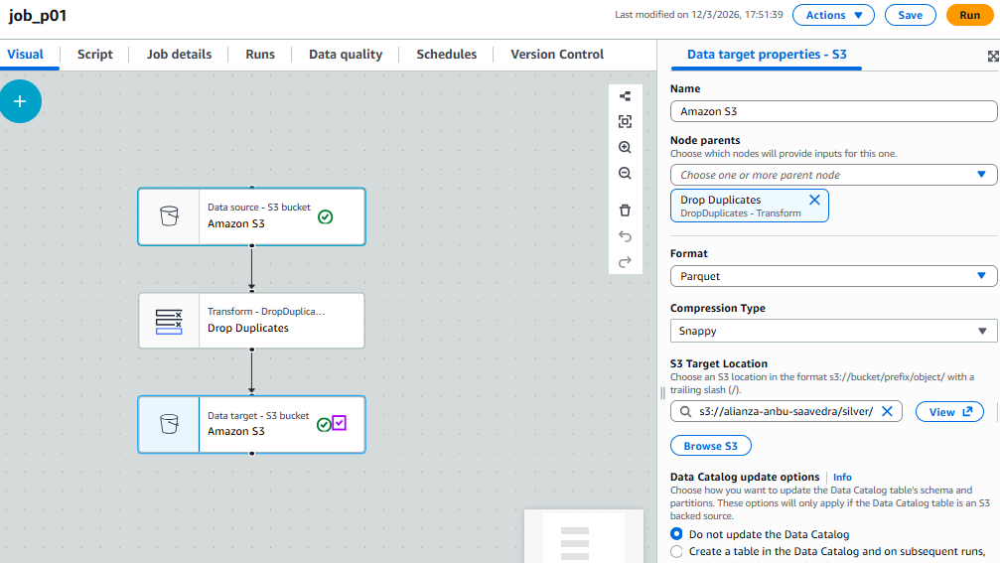
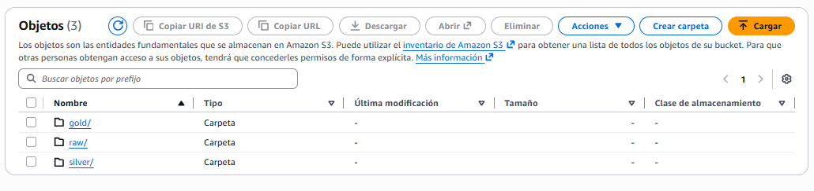
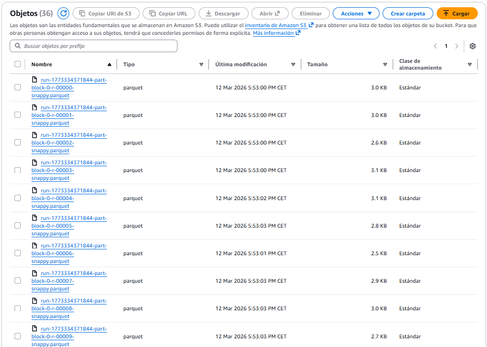

# Ejercicio S3

## 1. Job ETL

## 2. Estructura S3

## 3. Resultados S3

## 4. Comparación:

El csv entero pesa unos 136kb mientras que 1 solo archivo de la carpeta silver pesa 3kb

## 5. Reflexión:

El proceso Serverless no requiere gestionar servidores y puede ejecutarse automáticamente en la nube. Además, es más escalable y automático que un script manual en un PC.