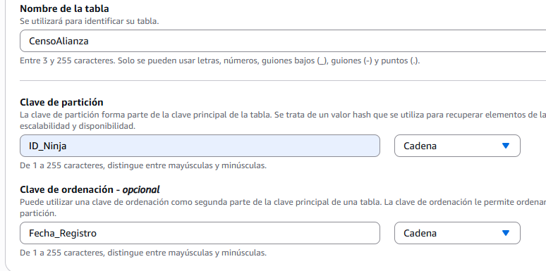
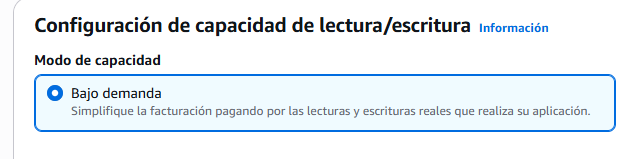
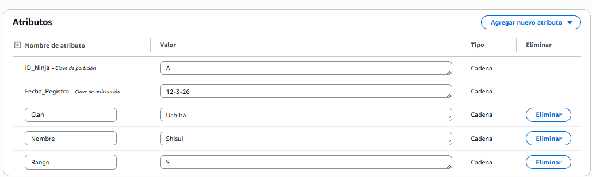
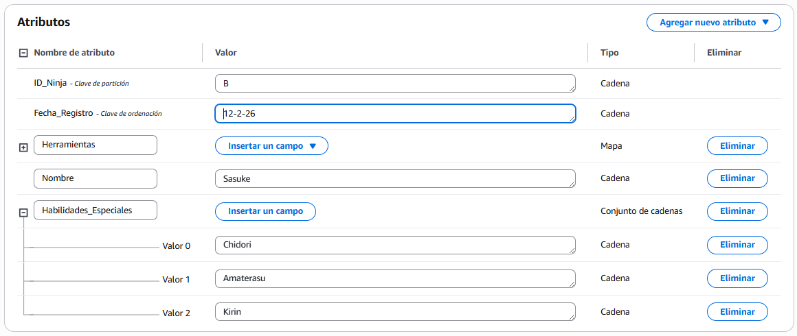
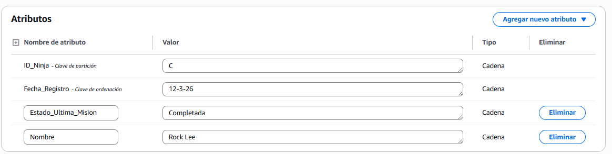
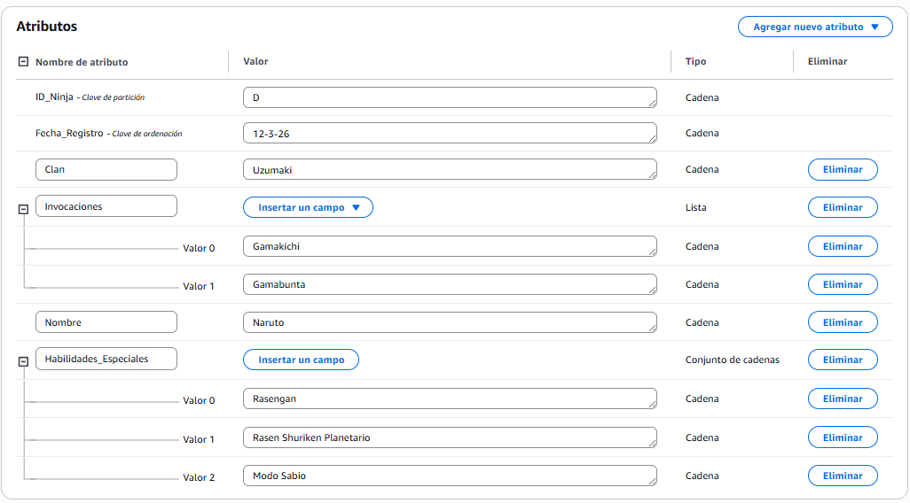
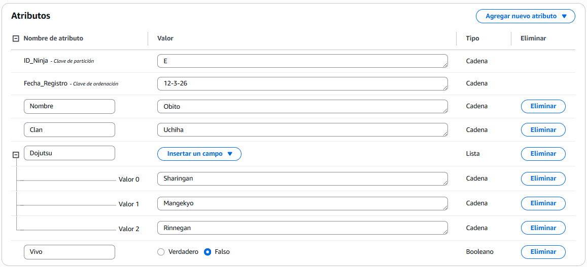
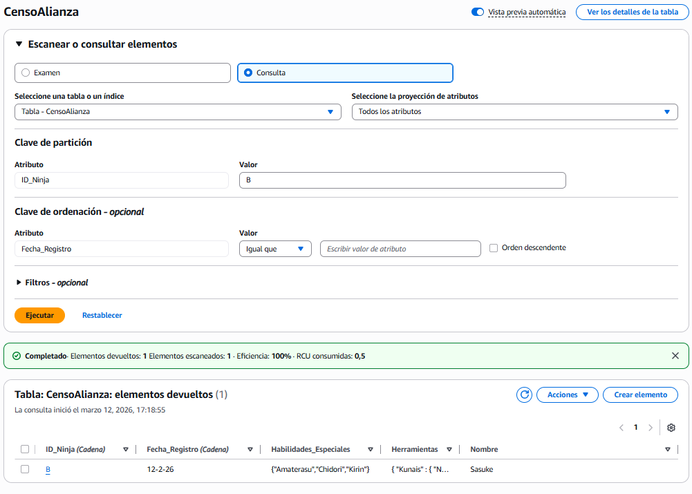
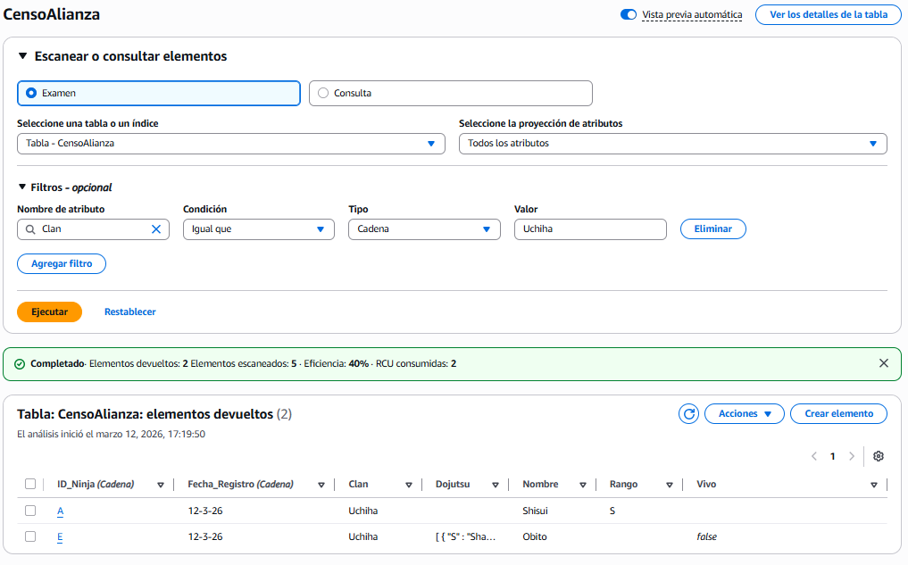
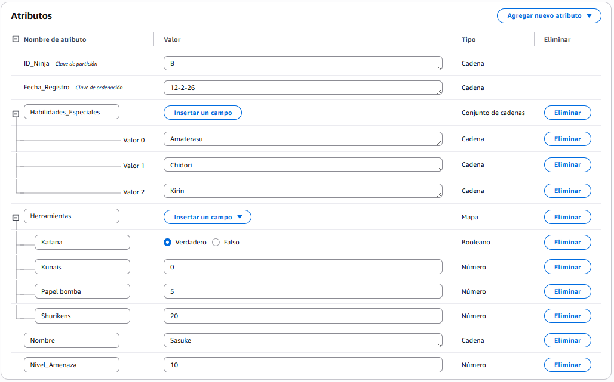

# Ejercicio DynamoDB

## 1. Creación de la tabla en DynamoDB

A continuación se muestran las capturas correspondientes al proceso de creación de la tabla en DynamoDB.

---

## 2. Inserción de elementos en la tabla

En esta sección se muestran las capturas de los elementos creados dentro de la tabla.  
Se han añadido **5 ninjas**, identificados con las letras **A, B, C, D y E**.

### Ninja A

### Ninja B

### Ninja C

### Ninja D

### Ninja E

---

## 3. Query en la tabla

A continuación se muestra una captura de la ejecución de una **query** realizada sobre la tabla de DynamoDB.

---

## 4. Scan de la tabla

Por último, se presenta la captura correspondiente a la operación **scan** realizada sobre la tabla.

## 5. Reflexión: Diferencia entre Scan y Query

**Scan** es más lento y costoso porque revisa **todos los elementos de la tabla** para encontrar los resultados.  

En cambio, **Query** busca directamente usando la **clave o un índice**, por lo que solo accede a los datos necesarios y es mucho más eficiente.

---

## 6. Actualización dinámica de un registro

En este apartado edite el Ninja B para añadirle un nivel de amenaza 10

---

## 7. Análisis técnico

Si las búsquedas se realizaran habitualmente por **Aldea**, sería conveniente usar **Aldea como Partition Key**, ya que DynamoDB está optimizado para buscar mediante la clave de partición.

Un **Global Secondary Index (GSI)** es un índice adicional que permite consultar la tabla usando **atributos distintos a la clave primaria original**. Esto permite realizar búsquedas eficientes sin cambiar la estructura principal de la tabla.